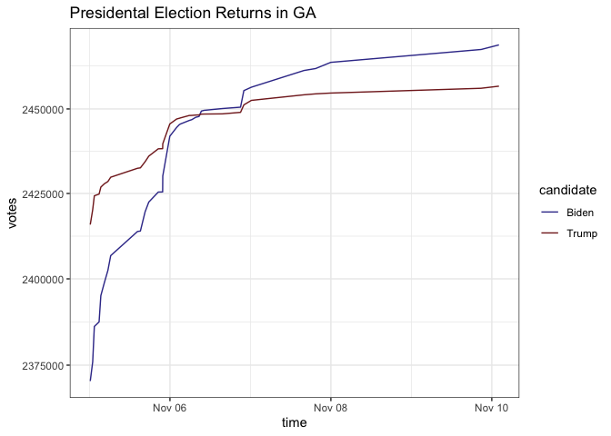

# 2020 Presidential Election Returns from Decision Desk

[Decision Desk HQ](https://decisiondeskhq.com) tweeted out election
returns for the 2020 presidential election on the night of the election
and the days that followed from [their Twittter
account](https://twitter.com/DecisionDeskHQ).

This repo preserves [those tweets](protected/decision-desk-timeline.csv)
and wrangles the information into [returns](returns.csv) by time, state,
and candidate.

``` r
library(tidyverse)
library(lubridate)

returns <- read_rds("returns.rds") %>%
  glimpse()
```

    ## Rows: 468
    ## Columns: 6
    ## $ state     <chr> "AZ", "AZ", "GA", "GA", "GA", "GA", "AZ", "AZ", "AZ", "AZ",…
    ## $ time      <dttm> 2020-11-10 02:09:35, 2020-11-10 02:09:35, 2020-11-10 02:08…
    ## $ candidate <chr> "Biden", "Trump", "Biden", "Trump", "Biden", "Trump", "Bide…
    ## $ votes     <dbl> 1648642, 1633896, 2469118, 2456781, 2467748, 2456157, 16434…
    ## $ share     <dbl> 0.4947, 0.4902, 0.4950, 0.4926, 0.4950, 0.4926, 0.4950, 0.4…
    ## $ text      <chr> "AZ Presidential Election Results\n\nBiden (D): 49.47% (1,6…

``` r
ga <- returns %>%
  filter(state == "GA") %>%
  filter(time > ymd("2020-11-05"))

ggplot(ga, aes(x = time, y = votes, color = candidate)) + 
  geom_line() + 
  scale_y_log10() + 
  scale_color_manual(values = c("Biden" = scales::muted("blue"),
                                "Trump" = scales::muted("red"))) + 
  theme_bw()
```

<!-- -->
